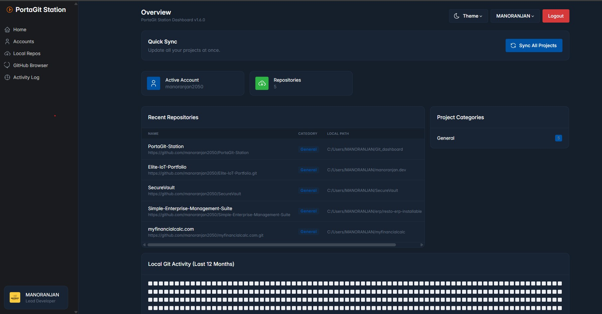
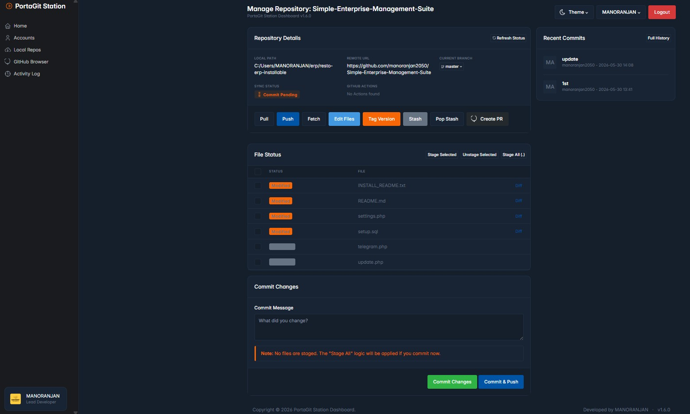
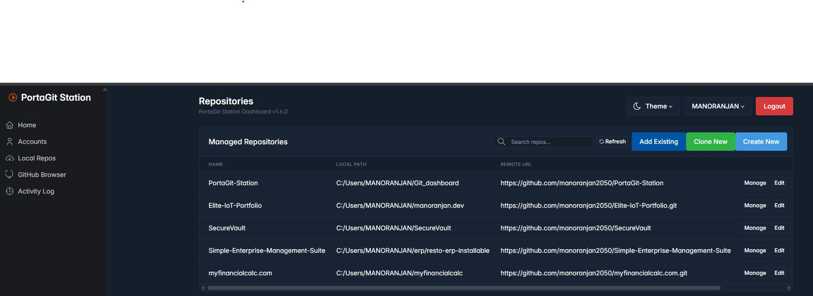
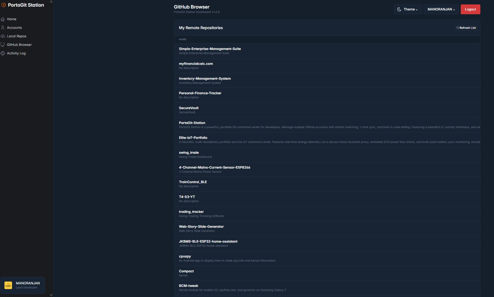
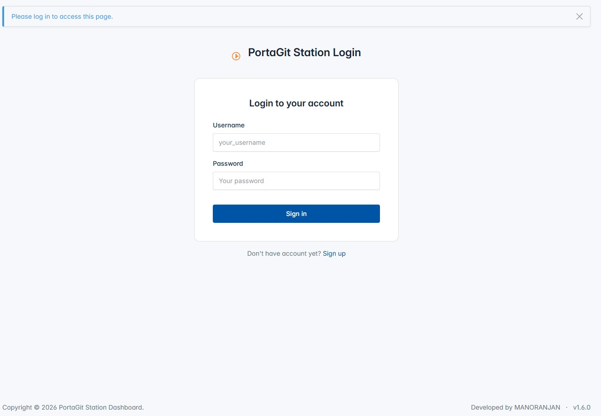
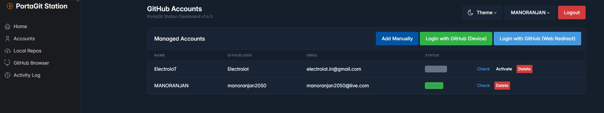
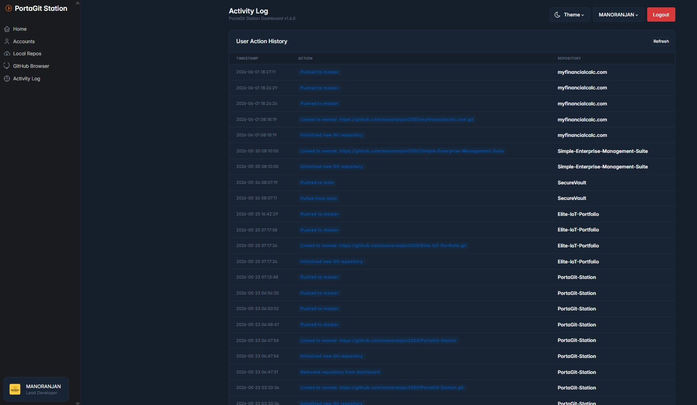
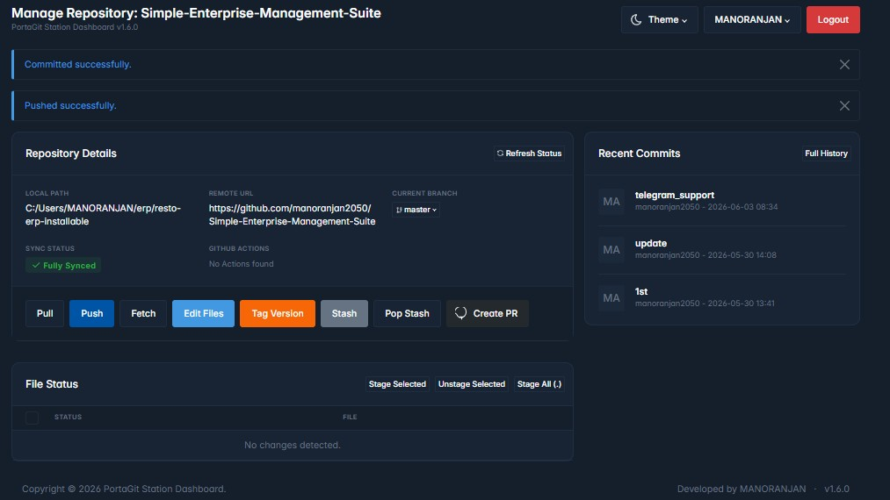

# 🚀 PortaGit Station v1.6.1
### Developed by [MANORANJAN](https://github.com/manoranjan2050)

**PortaGit Station** is a powerful, portable Git command center for developers. Manage multiple GitHub accounts with instant switching, 1-click sync, and built-in code editing. Featuring a beautiful UI, activity heatmaps, and secure local encryption, it’s the ultimate station for your repositories.

---

## 🔥 Recent Improvements (v1.6.1)
- **✨ Enhanced Staging:** Multi-select files for surgical staging and unstaging.
- **🚀 One-Click Push:** New "Commit & Push" flow for faster development.
- **🛡️ Robust Git Engine:** Improved handling for newly initialized repositories and detached HEAD states.
- **✅ Action Feedback:** Native system feedback when opening folders and performing syncs.
- **🛠️ Bug Fixes:** Resolved issues with the Remove button and repository navigation.

---

## ✨ Key Features

- **📂 Multi-Account Management:** Switch between Personal, Work, and Client GitHub accounts in 1 second.
- **🛠️ Power Git Operations:** 1-click Clone, Pull, Fetch, Commit, Push, and Tagging.
- **📝 Built-in Editor:** Edit your code directly in the browser with our integrated file browser.
- **⚡ Pro Tools:** Stash management, Visual Diff viewer, and Mass Sync (Backup) capabilities.
- **🖥️ Local Server Launcher:** Set custom run commands (like `python app.py`) and launch projects from the UI.
- **💼 Organized Workflow:** Group repositories into categories like *Work*, *IoT*, or *Private*.
- **📊 Activity Heatmap:** Visualize your local Git contributions with a professional activity graph.
- **🔒 Secure by Design:** Personal Access Tokens (PAT) are AES-encrypted before being stored in your local SQLite database.
- **🌐 Cross-Platform:** Works on Windows, macOS, and Linux with native system support.

---

## 📸 Screenshots

### 🖥️ Dashboard Overview

*The central hub for managing all your repositories and viewing activity heatmaps.*

### 📂 Repository Management

  
  

*Easily organize and view details of your local repositories.*

### 📝 Code Editor & Git Browser

*Integrated file browser and editor for quick code changes.*

### 🔑 Account & Security

  
  

*Secure login and multi-account management with PAT encryption.*

### 📜 Git Logs & Workflow

  
  

*Track history and get instant feedback on your Git operations.*

---

## 🛠️ Technology Stack

- **Backend:** Python + Flask
- **Database:** SQLite (No installation required)
- **Git Engine:** GitPython
- **Frontend:** HTML5, CSS3, Tabler UI Framework
- **Icons:** Tabler Icons

---

## 🚀 Quick Start (Portable Use)

1. **Prerequisites:** Install [Python 3.x](https://www.python.org/).
2. **Launch:** Double-click `start_server.bat`.
3. **Login:** Go to the **Accounts** section and add your GitHub PAT (Personal Access Token).
4. **Manage:** Add your existing projects or clone new ones directly from the dashboard.

---

## 🔨 Build into .EXE (Portable Mode)
To create a standalone file that doesn't need Python:
1. Run `pip install pyinstaller`
2. Double-click `build_exe.bat`
3. Find your app in the `dist/` folder.

---

## 👨‍💻 Author & Credits
Developed with ❤️ by **MANORANJAN**.

### 🌐 Connect with Me
- **Portfolio:** [manoranjan.dev](http://manoranjan.dev)
- **IoT Projects:** [electroiot.in](https://electroiot.in)
- **Financial Tools:** [myfinancialcalc.com](https://www.myfinancialcalc.com)
- **GitHub:** [@manoranjan2050](https://github.com/manoranjan2050)
- **Contact:** [Get in Touch](https://manoranjan.dev/contact.php)

### 🤝 Attribution & Open Source Rules
This project is open-source, but **attribution is required**. If you use this project's code, dashboard design, or logic in your own work, you MUST provide clear credit.

**Required Attribution Format:**
> "Based on [PortaGit Station](https://github.com/manoranjan2050/PortaGit-Station) by [MANORANJAN](https://github.com/manoranjan2050)"

**Usage Rules:**
1. **No Commercial Resale:** You may not sell this software as a standalone product.
2. **Preserve Headers:** All copyright notices and developer credits in the source code must remain intact.
3. **Open Contribution:** Improvements are welcome via Pull Requests.

---

## ⚠️ Legal Disclaimer
**"AS-IS" SOFTWARE:** This software is provided for educational and productivity purposes. The author (MANORANJAN) is not responsible for any data loss, repository corruption, or security breaches resulting from the use of this tool. 
- Always ensure your GitHub Personal Access Tokens (PAT) are stored securely.
- Use at your own risk. The developer provides no warranty or guarantee of any kind.

---

## 📝 License
This project is licensed under the **MIT License**.
*Copyright (c) 2026 MANORANJAN*

Permission is hereby granted, free of charge, to any person obtaining a copy of this software to deal in the Software without restriction, subject to the conditions outlined in the [LICENSE](LICENSE) file.

---

*Inspired by the need for speed and simplicity in Git workflows.*
